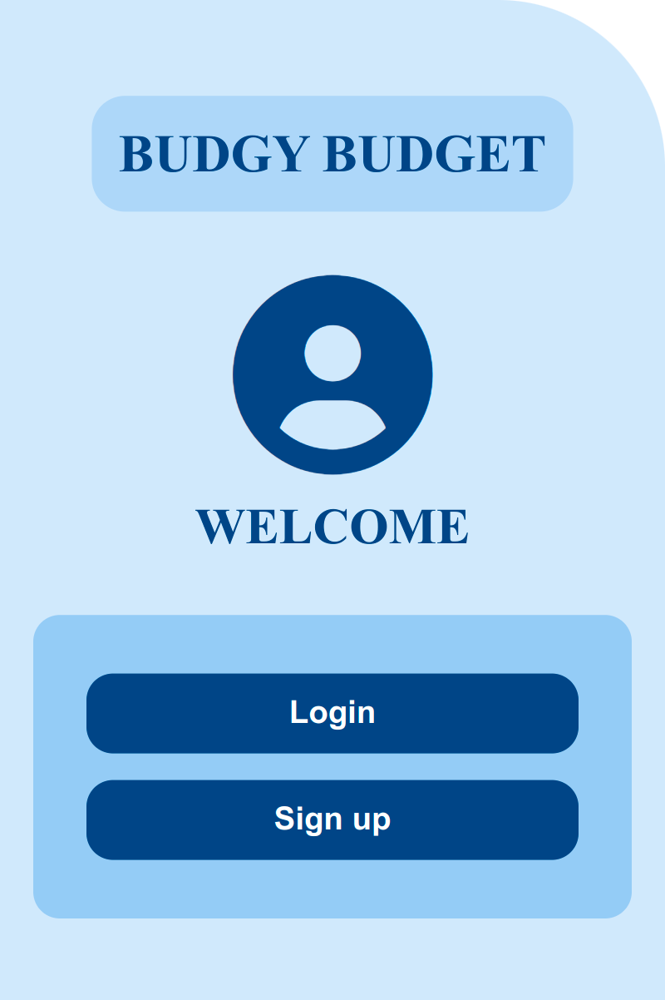
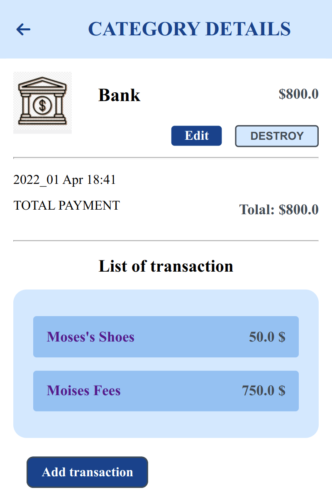
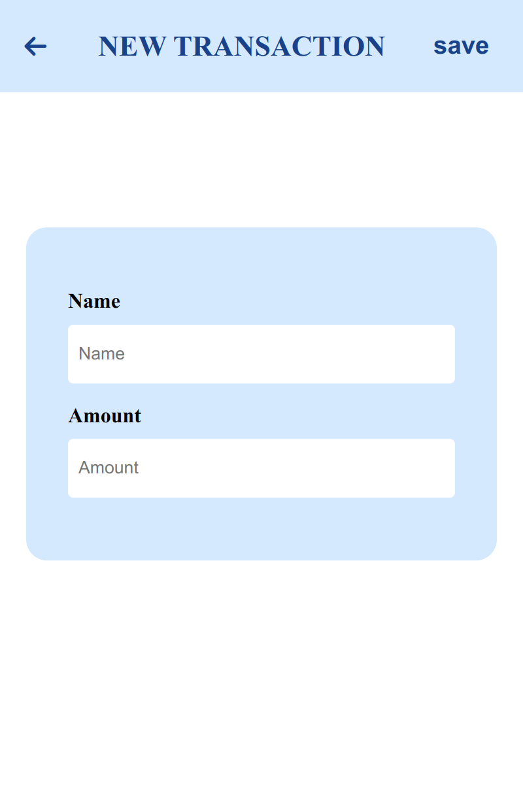
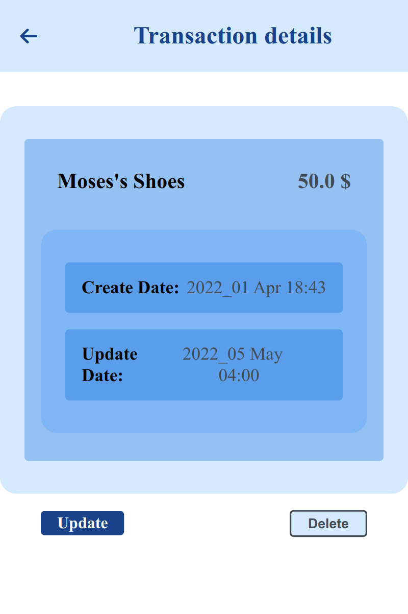

# Budgy-Budget


## Description

> The Ruby on Rails capstone project ([remember what they are?](https://github.com/microverseinc/curriculum-html-css/blob/main/articles/capstone_intro.md)) is about building a mobile web application where you can manage your budget: you have a list of transactions associated with a category, so that you can see how much money you spent and on what.

- I created a Ruby on Rails application that allows the user to:

  - register and log in, so that the data is private to them.
  - introduce new transactions associated with a category.
  - see the money spent on each category.

### Screenshots 📸

|       Home Page                 |          Category Page                |         Add Category Form                |
:--------------------------------:|:-------------------------------------:|:-------------------------------------------:|
 | | |


|         Category-Transaction    |        Add Transaction Form           |         Transaction Details                |
:--------------------------------:|:-------------------------------------:|:-------------------------------------------:|
 | | |


## Learning objectives

- Use ruby gems as software packages system.
- Install Ruby on Rails framework.
- Understand Rails RESTful design and router.
- Use controllers to handle requests and render empty views.
- Use params from browser request in a safe way.
- Use preprocessed html file with embedded Ruby code.
- Use layouts and templates for shared content.
- Use database migration files to maintain database schema.
- Use validations for models.
- Secure app from n+1 problems.
- Understand what ORM is.
- Write SQL queries with ActiveRecord.
- Set up associations between models.
- uild a webapp that requires the user to log in.
- Use devise gem for authentication.
- Limit access to webapp resources based on authorization rules.
- Analyze in writing why you have made a coding choice using one structure over another.

## Live Demo 🔗

[Live Demo Link](https://budgy-budget-api.herokuapp.com)

## Loom Video 🔗

[Loom Video Link](https://www.loom.com/share/2d1971886acf41eab27ea244c1f1acdb)

## Getting Started

To get a local copy for this project and running follow these simple example steps.

### Prerequisites

- You need to have git installed in your machine.
- Install a recent version of Postgres.
- Already install Rails


## Setup

## Setting Up PostgreSQL

- The postgres installation doesn't setup a user for you, so you'll need to follow these steps to create a user with permission to create databases

```bash
$  sudo -u postgres createuser blog-app -s
```

### Creating the Budgy-Budget application

- To create project with PostgreSQL database 

```bash
$   rails new Rails-capstone-Budgy-Budget --database=postgresql  #or
$   rails new Rails-capstone-Budgy-Budget -d postgresql

$   cd Rails-capstone-Budget-app # Move into the application directory
```


### Clone this repository

```bash
$ git clone https://github.com/BenMukebo/Budgy-Budget.git
$ cd Budgy-Budget
```

### Create the database

```bash
$   rails db:create   # or
$   rake db:create
```

### Install linter and 

- Rubocop gem

```bash
$  bundle init
$  bundle install
```
- Stylelint package

```bash
$  npm init -y
$  npm install
$  npm install --save-dev stylelint@13.x stylelint-scss@3.x stylelint-config-standard@21.x stylelint-csstree-validator@1.x

```

- Run linter

```bash
$  rubocop .
$  npx stylelint "**/*.{css,scss}" 
```

- In auto-correct mode, RuboCop will try to automatically fix offenses:

```bash
$  rubocop -A # or
$  rubocop --auto-correct-all
$  npx stylelint "**/*.{css,scss}" --fix 
```


### Starting up the Web Server

```bash
$   rails s # or
$   rails server # or
$   rails server -p3001
```

- To restart the server

```bash
$  sudo service postgresql restart 
$  rails db:reset #to clean the database                                                                    
```

#### Listing Existing Routes

- You can now visit `http://localhost:3000` to view your new website!

 You can also execute the `rails routes` command in your terminal to produce the same output.


#### Generate rspec

- At the first you need to include those lines in your Gemfile

```bash
  gem 'rails-controller-testing'
  gem 'rspec-rails'
```

#### Install RSpec

```bash
$  rails generate rspec:install
```
- This should generate some files that you will need to run your tests and should give us a Controller and a View

- Then run:

```bash
$  rspec spec     # to test if your tests are passed
```

#### Generate MVC with scaffold

```bash
  $  rails g scaffold category name user:belongs_to
  $  rails g scaffold records name amount:decimal user:belongs_to 
  $  rails g scaffold category_records user:belongs_to
  $  rails g scaffold category_records category:belongs_to record:belongs_to
```

#### Generate Schema

- To push the Migration into the database

```bash
  $   rails db:migrate
```
- We use the seeds.rb file to records in the database
- To drop, create a table and to migrate and send the seed into the database:

```bash
  $   rails db:drop db:create db:migrate db:seed  
```

- To check available routes

```bash
  $   rails routes  
```

#### Run Capybara

```bash
$  bundle exec rspec ./spec/features/
```

#### Run spec

```bash
$  bundle exec rspec ./spec/models/
```

## Built With 🛠️

This project is build with:

-  
-  

## Authors

👤 **Ben Mukebo**

- GitHub: [@BenMukebo](https://github.com/BenMukebo)
- Twitter [@BenMukebo](https://twitter.com/BenMukebo)
- LinkedIn [BenMukebo](https://www.linkedin.com/in/kasongo-mukebo-ben-591720205/)

## 🤝 Contributor


Contributions, issues, and feature requests are welcome!

Feel free to check the [issues page](https://github.com/BenMukebo/Blog-app/issues).

## Show your support

Give a ⭐️ if you like this project!

## Acknowledgments

- Credit to [Gregoire Vella on Behance](https://www.behance.net/gregoirevella), the author of the original [design guidelines](https://www.behance.net/gallery/19759151/Snapscan-iOs-design-and-branding?tracking_source=)


## 📝 License

This project is [MIT](./MIT.md) licensed.
